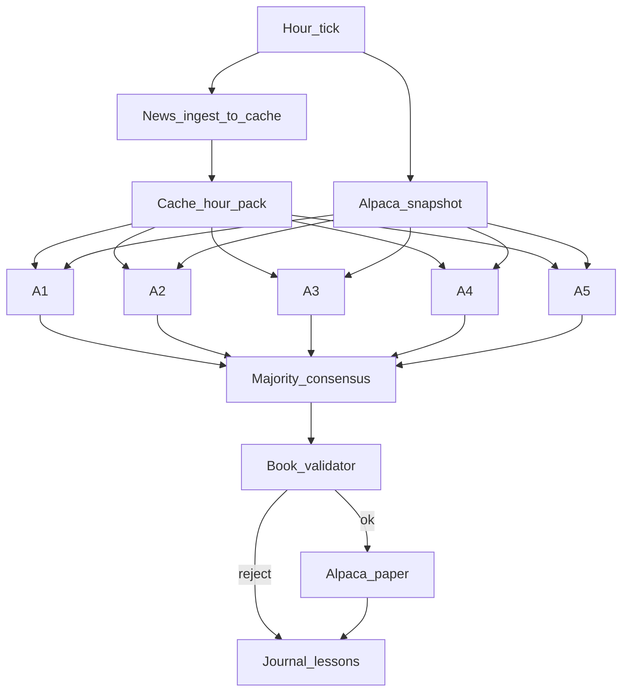

---
todos:
  - id: docs-schema
    status: completed
    content: Update project-context; add consensus.md + hourly proposal schema
  - id: news-cache-hourly
    status: completed
    content: Pre-consensus news ingest into state/news_cache then build hour pack from cache
  - id: alpaca-client
    status: completed
    content: Alpaca paper client + book mirror (env secrets from Josh)
  - id: consensus-engine
    status: completed
    content: Majority/median consensus + book validator + fixtures
  - id: hourly-packs
    status: completed
    content: Hourly packs/prompts and state/hourly layout
  - id: run-hourly
    status: completed
    content: run_hourly.py orchestration + dry-run
  - id: smoke-paper
    status: completed
    content: Dry-hour smoke; first paper hour once Alpaca keys are set
name: Alpaca Hourly Consensus
overview: Run five risk-tier LLM agents hourly on Alpaca paper; majority (≥3/5) consensus drives one shared $1000 book. Each hour refreshes news into the local cache before fan-out. Models are available again.
isProject: false
---
# Alpaca paper hourly consensus

Full plan: [`/cursor/stores/self/docs/alpaca-hourly-plan.md`](/cursor/stores/self/docs/alpaca-hourly-plan.md)

## Locked decisions

- **Alpaca paper only**; one shared book; **$1000** start
- **Five agents** (same A1–A5 models/tiers) propose each hour; they do **not** trade separately
- **Majority consensus:** a `(symbol, side)` leg executes only if **≥3 of 5** proposed it; size = **median** of agreeing agents; empty proposals are holds and do not count toward the 3
- **Book caps:** cash floor 15%, max name 35%, max 6 positions; fail → hold
- **Cadence:** on the hour **10:00–15:00** America/New_York on NYSE days
- **News:** before each consensus hour, **ingest/update sources into `state/news_cache/`** (same batch-cache pattern as backfill), then build the hour pack **cache-only** — no per-agent upstream hammering
- Universe/fidelity unchanged (US equity/ETF, long-only, no invented news, prefer hold over forced trades)
- **Models available again** (A3 Gemini / A4 Opus); resume original roster. Historical daily backfill stays paused unless Josh asks to resume it

## Architecture

## Implementation

1. Docs/schemas: update [`project-context.md`](/cursor/stores/self/docs/project-context.md); add `docs/consensus.md`; hourly proposal schema
2. News: hourly `fetch_news.py ingest` (live feeds / incremental) → cache; `build-hour` from cache only for the tick cutoff
3. `scripts/alpaca_client.py` — paper API, reconcile `state/book/portfolio.json` (keys via env, never in store)
4. `scripts/consensus.py` + `validate_book.py` — majority/median + book caps; fixture tests
5. Hourly packs/prompts + `state/hourly/YYYY-MM-DD/HH/` layout
6. `scripts/run_hourly.py` + orchestration; dry-run path
7. Smoke dry hour; first paper hour after Josh sets Alpaca paper keys

## Blockers before first paper hour

- Alpaca paper credentials received (endpoint `https://paper-api.alpaca.markets/v2`). Wire via env `APCA_API_KEY_ID` / `APCA_API_SECRET_KEY` / `APCA_API_BASE_URL` at implementation time — **never commit keys to the store**. Josh should rotate the key if this chat is retained long-term.
