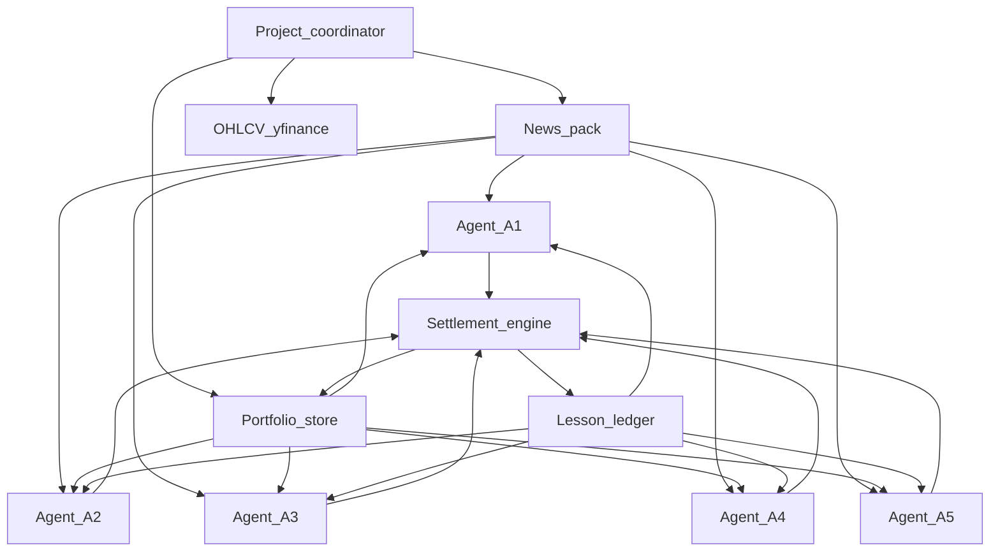

---
todos:
  - id: foundation
    status: completed
    content: 'Create project context, agent roster/rules, $100 portfolios, sim meta, batch schema + validator'
  - id: market-news
    status: completed
    content: 'Trading calendar, yfinance OHLCV, multi-source news + GDELT backfill freezers'
  - id: settlement
    status: completed
    content: 'Settlement engine: validate, fill at open, EOD marks, journals, lesson ledger'
  - id: agent-prompts
    status: completed
    content: Per-tier prompts + coordinator fan-out across five LLM model IDs
  - id: backfill
    status: completed
    content: Backfill driver from 2026-06-01 through today with periodic checkpoints
  - id: live-mode
    status: completed
    content: Switch to live pre-market / EOD cadence after catch-up
name: DayTrade Simulator
overview: 'Build a Cursor-orchestrated US equity/ETF simulator: five rules-constrained agents on different LLMs place one pre-market batch per day from multi-source news, own history, and shared lessons—backfilling from 2026-06-01, then running live.'
isProject: false
---
# DayTrade simulator plan

Cursor-orchestrated investment simulator: five rules-constrained agents with different LLMs each place one pre-market trade batch per US trading day, driven by multi-source news, own history, and shared lessons.

Full plan doc: [`/cursor/stores/self/docs/daytrade-simulator-plan.md`](/cursor/stores/self/docs/daytrade-simulator-plan.md)

## Locked decisions

- **Universe:** US equities and ETFs only; long-only; fractional shares (required at $100 start).
- **Capital:** $100 per agent; sim start **2026-06-01**; step one trading day at a time through today, then live pre-market / EOD cadence.
- **Runtime:** entirely within Cursor (this Project + cloud agents). No changes to the current Kubespray checkout.
- **Decision style:** hard **rules** per risk tier; LLMs choose trades *inside* those rules.
- **Prices:** Yahoo Finance daily bars (`yfinance`) for OHLCV; fills at that day’s **open**.
- **News (bias-aware):** Reuters Business, Yahoo Finance, MarketWatch, plus SEC EDGAR material-event headlines. Live via RSS/EDGAR; backfill via **GDELT** filtered to those sources for the same calendar day *before* US open (no lookahead).

## Five agents

- **A1** Very conservative — 40% cash floor, 15% max name, 3 positions — `gpt-5.6-sol-medium`
- **A2** Conservative — 25% / 25% / 4 — `claude-sonnet-5-thinking-medium`
- **A3** Balanced — 15% / 35% / 6 — `gemini-3.8-flash-medium`
- **A4** Aggressive — 5% / 50% / 8 — `claude-opus-5-thinking-medium`
- **A5** Speculative — 0% / 80% / 10 — `grok-4.7-medium`

Shared: US equity/ETF only; no options/crypto/OTC/shorts; one batch/day; invalid batch rejected → hold.

## Architecture

### Store layout

- [`docs/project-context.md`](/cursor/stores/self/docs/project-context.md) — goals, rules, roster
- `state/` — sim meta, per-agent portfolios/journals, news packs, market prints, lesson ledger
- `scripts/` — Python: news fetch, batch validate, settle day, advance calendar

### Daily cycle

1. Build dated news pack + portfolios + lessons (timestamps before RTH open).
2. Fan out five cloud agents; each returns JSON batch + thesis.
3. Validate against tier rules (reject whole batch on failure).
4. Fill at open; EOD mark at close; append journals + anonymized lessons.
5. Advance trading day; backfill until caught up, then live morning/EOD.

## Build sequence

1. Foundation: context, roster/rules, $100 portfolios, sim meta, schema + validator
2. Market + news scripts (calendar, yfinance, multi-source + GDELT freeze)
3. Settlement engine (fractional fills, marks, journals, ledger)
4. Agent prompts + coordinator fan-out with the five model IDs
5. Backfill driver Jun 1 → today (checkpoint ~every 20 sessions)
6. Live mode: pre-market expectations + EOD results in notes

## Out of scope (v1)

Web UI, live broker execution, options/crypto/shorts, intraday bars.
