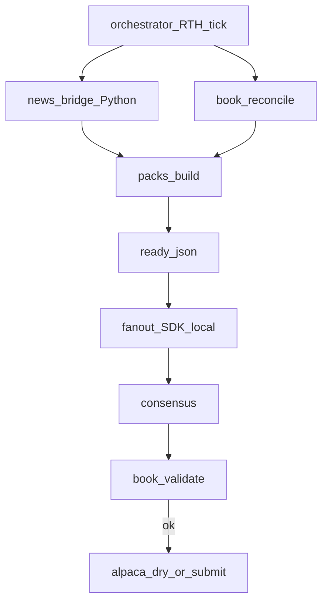

---
todos:
  - id: scaffold-workspaces
    status: completed
    content: 'Create services/ npm workspaces + @daytrade/shared (paths, hour bucket, calendar, env)'
  - id: port-book-consensus-packs
    status: completed
    content: 'Implement @daytrade/book, consensus, packs, news-bridge (Python spawn)'
  - id: fanout-sdk-local
    status: completed
    content: Implement @daytrade/fanout with Cursor SDK local agents + roster models
  - id: orchestrator-cli
    status: completed
    content: Implement @daytrade/orchestrator RTH loop prep/fanout/settle replacing hourly_scheduler
  - id: windows-docs
    status: completed
    content: Point Windows installer/scripts at Node orchestrator; add docs/control-plane.md
name: JS control plane
overview: 'Rewrite the DayTrade hourly control plane in TypeScript as separate portable packages (future Docker services), keeping Python only for news ingest/build-hour. Fan-out uses Cursor SDK local agents with roster model IDs against the Project store cwd.'
isProject: false
---
# JS/TS control plane (hybrid, multi-package)

## Decisions (locked)

- **Hybrid:** TypeScript owns scheduler, packs, fan-out, consensus, book validate, Alpaca; Python keeps news (`fetch_news.py` ingest / `build-hour`).
- **Fan-out v1:** Cursor SDK **local** agents (`local: { cwd: STORE_ROOT }`), one agent per A1–A5 with roster `model_id`.
- **Layout:** separate top-level packages under the store (not one monolith), each Docker-ready later; no Dockerfiles required in v1 beyond a stub note.
- **Secrets:** stay outside store (`%USERPROFILE%\.daytrade\*.env`); packages read env only.
- **Python scripts** remain as the news worker; Windows installer points at the new TS orchestrator.

## Target layout

```
services/
  shared/           # @daytrade/shared — types, paths, hour buckets, env load, JSON IO
  news-bridge/      # @daytrade/news-bridge — spawn Python fetch_news.py
  book/             # @daytrade/book — Alpaca client + sizing_book (-99000) + validate
  consensus/        # @daytrade/consensus — majority ≥3/5, median size
  packs/            # @daytrade/packs — render hourly A1–A5.md from template
  fanout/           # @daytrade/fanout — Cursor SDK local agents → A?.json
  orchestrator/     # @daytrade/orchestrator — RTH loop: prep → fanout → settle
  windows/          # installers updated to start orchestrator (node)
```

Shared contracts stay file-based (same paths as today): `state/hourly/YYYY-MM-DD/HH/{news,ready,A*.md,A*.json,consensus,settle}.json`.



## Package responsibilities

### `@daytrade/shared`
- Port essentials from [`scripts/paths.py`](scripts/paths.py), [`scripts/hour_bucket.py`](scripts/hour_bucket.py), [`scripts/trading_calendar.py`](scripts/trading_calendar.py) (RTH 10–15 ET, NYSE day check).
- `loadEnvFile(path)` (refuse paths under store), `STORE_ROOT` from `DAYTRADE_STORE`.
- Types for hourly proposal / consensus / book mirror.

### `@daytrade/news-bridge`
- Thin wrapper: `python fetch_news.py ingest --live-feeds` then `build-hour BUCKET` with cwd [`scripts/`](scripts/).
- Surface stdout JSON; `--skip-ingest` / fixture flags for smoke.

### `@daytrade/book`
- Port [`scripts/alpaca_client.py`](scripts/alpaca_client.py) + `sizing_book` / [`scripts/validate_book.py`](scripts/validate_book.py) to TS (urllib → `fetch`).
- Config from [`state/alpaca/config.json`](state/alpaca/config.json) (`equity_offset_usd: -99000`).

### `@daytrade/consensus`
- Port [`scripts/consensus.py`](scripts/consensus.py) pure functions; CLI for smoke.

### `@daytrade/packs`
- Port [`scripts/build_hourly_packs.py`](scripts/build_hourly_packs.py); template [`prompts/hourly_input_template.md`](prompts/hourly_input_template.md); sizing book view in packs.

### `@daytrade/fanout`
- `CURSOR_API_KEY` required.
- For each agent in [`state/roster.json`](state/roster.json): `Agent.create({ apiKey, model: { id: model_id }, local: { cwd: storeRoot } })`, prompt = system + tier + pack markdown, instruct write **only** `state/hourly/.../A{n}.json` (raw JSON).
- Parallel launch; timeout/deadline (~15–20 min); record agent ids under `state/hourly/.../fanout.json`.
- No cloud runtime in v1.

### `@daytrade/orchestrator`
- Replace [`scripts/hourly_scheduler.py`](scripts/hourly_scheduler.py) + phase logic from [`scripts/run_hourly.py`](scripts/run_hourly.py):
  - `prep` → news-bridge + reconcile + packs + `ready.json`
  - `fanout` → SDK local
  - `settle` → consensus + validate + dry-run submit ( `--submit` opt-in)
  - `prep-then-settle` default for the Windows loop
- Write `state/scheduler/status.json`.

## Tooling

- Root [`services/package.json`](services/package.json) workspaces (`shared`, `news-bridge`, `book`, `consensus`, `packs`, `fanout`, `orchestrator`).
- TypeScript + `tsx` for run; Node 20+.
- Deps: `@cursor/sdk`, workspace refs only (no secrets in package.json).
- Each package: `src/index.ts`, `package.json` with `"name": "@daytrade/..."`, future `Dockerfile` placeholder comment in README only (no images in v1).
- Env example: extend `%USERPROFILE%\.daytrade\alpaca.env` pattern with `CURSOR_API_KEY=` in [`services/windows/daytrade.env.example`](services/windows/daytrade.env.example) (not under store secrets).

## Windows integration

- Update [`scripts/windows/Start-HourlyScheduler.ps1`](scripts/windows/Start-HourlyScheduler.ps1) / Installer to prefer:
  `node services/orchestrator/dist/cli.js` (or `npx tsx …`) with same Task Scheduler / Startup fallback.
- Keep Python on PATH for news-bridge.
- Document in [`docs/windows-scheduler.md`](docs/windows-scheduler.md) + new [`docs/control-plane.md`](docs/control-plane.md) (service map + env + fan-out).

## Compatibility

- Leave existing Python CLIs in place for smoke/fallback; orchestrator is the new primary entry.
- Do not edit plan file [`docs/alpaca-hourly-plan.md`](docs/alpaca-hourly-plan.md) frontmatter artifact.
- Do not commit API keys; do not PR kubetest.

## Verification

- Unit: consensus median/majority fixtures under `fixtures/hourly/`.
- `orchestrator --hour … --phase prep` (news via Python).
- `fanout` dry stub mode if `CURSOR_API_KEY` missing (copy fixtures) for CI-less smoke; live local SDK when key present.
- Book validate with 100k + offset → ~1000 sizing.
- Windows: task still `DayTradeHourlyConsensus` → new node entry.
