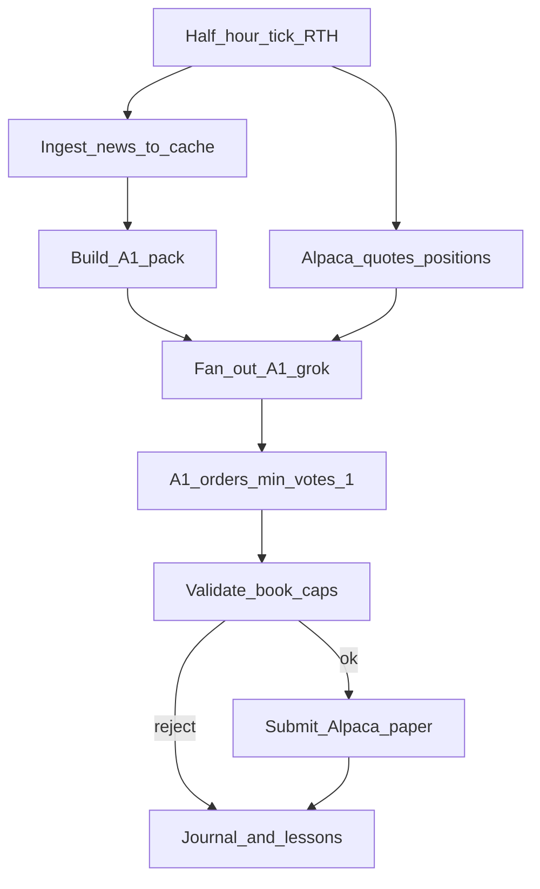

# Alpaca paper hourly — single Grok agent

Move from daily open-batch backfill to **Alpaca paper** trading: **one** Grok agent (`A1`, medium-aggressive) proposes each RTH half-hour; validated orders drive a **single** shared book. Starting equity **$1000**. Fidelity over profits.

**Token spend:** 5-way fan-out retired. No A2–A5 parallel launches.

## Locked decisions

| Decision | Value |
|----------|-------|
| Broker | Alpaca **paper** only (no live until explicitly approved) |
| Book | One shared portfolio, $1000 start (sizing via `equity_offset_usd: -99000`) |
| Agent | **A1 only** — `grok-4.7`, medium-aggressive |
| Risk | Cash floor **8%**, max name **45%**, max **7** positions |
| Cadence | **30-minute** RTH ticks 09:30–15:30 America/New_York |
| Trade trigger | A1’s valid orders (`min_votes=1`); empty = **hold**. No ≥2 majority |
| News | Ingest into `state/news_cache/` before each tick, then build pack from cache |
| Universe | US equities & ETFs; long-only; fractional OK |
| Fidelity | No invented news/prices; empty proposals OK; do not optimize for looking profitable |
| Credentials | Josh supplies Alpaca paper keys via env (never stored in the Project store) |

## Settle rules

1. Each tick, A1 returns one **proposal** (`as_of` = ISO 30-minute RTH bucket).
2. Valid buy/sell legs become the settle order list (`min_votes=1`). Legacy filename `consensus.json` kept.
3. Empty `orders` → **hold** (valid; Discord “Proposal · hold”).
4. **Book caps** (shared): cash floor **8%**, max single name **45%**, max **7** positions. Breach → whole-batch reject / hold.
5. Book validator + paper submit still run after settle build.

## Hourly cycle

1. **Tick** — orchestrator / `run_hourly.py` at :00/:30 RTH.
2. **News ingest** — cache feeds with backoff.
3. **Pack** — `A1.md` only (+ signals, sizing book, lessons).
4. **Fan-out** — one local SDK agent `grok-4.7` → `A1.json`.
5. **Settle** — `@daytrade/consensus` / `consensus.py` → `consensus.json`.
6. **Validate + execute** — caps 8%/45%/7; Alpaca paper (or hold / dry-run).
7. **Journal** — thesis, settle log, Discord Proposal + Submit.

## Store pointers

- [`docs/consensus.md`](./consensus.md) — settle + caps
- [`docs/orchestration.md`](./orchestration.md) — fan-out playbook
- `state/roster.json` — authoritative A1 risk + model
- Secrets: `%USERPROFILE%\.daytrade\alpaca.env`

## Explicitly out of scope (v1)

- Live (real-money) Alpaca
- Multi-agent majority / A2–A5 hourly fan-out
- Separate Alpaca accounts per agent
- Continuing daily backfill in parallel (paused unless Josh resumes it)
