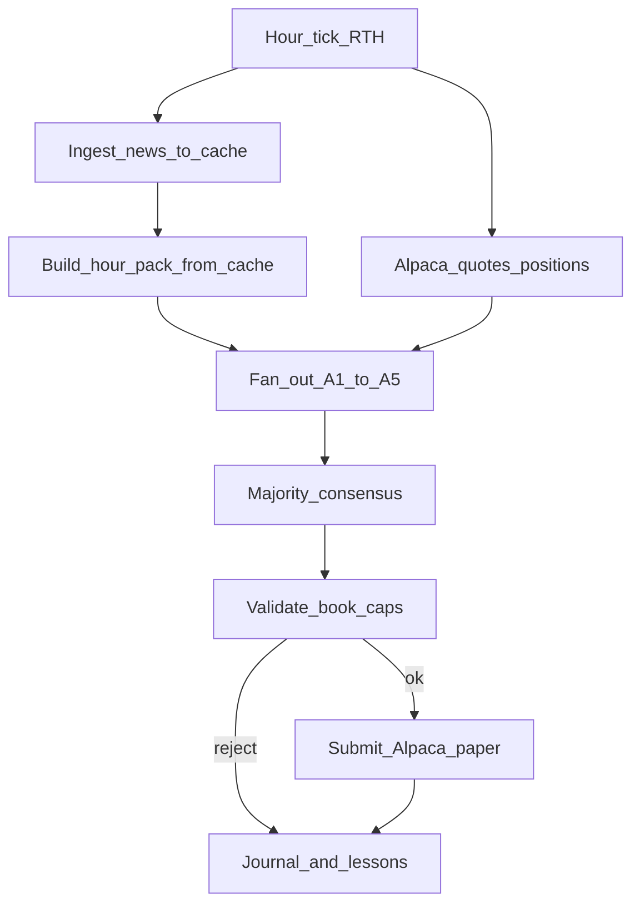

# Alpaca paper hourly consensus plan

Move from daily open-batch backfill to **Alpaca paper** trading: five risk-tier agents propose each hour; **majority (3/5)** consensus drives a **single** shared book. Starting equity **$1000**. Fidelity over profits; lessons from the daily backfill seed the live book.

**Models are available again** (A3 Gemini / A4 Opus). Historical daily backfill stays paused unless resumed separately. Hourly consensus can proceed once Alpaca paper keys are set.

## Locked decisions

| Decision | Value |
|----------|-------|
| Broker | Alpaca **paper** only (no live until explicitly approved) |
| Book | One shared portfolio, $1000 start |
| Agents | Same A1–A5 roster / models / risk *proposal* tiers |
| Cadence | Hourly during US RTH (on the hour: 10:00–15:00 America/New_York) |
| Trade trigger | Majority consensus: **≥3 of 5** agree on `(symbol, side)` |
| News | **Ingest/update sources into `state/news_cache/` before each consensus hour**, then build the hour pack from cache only (same anti-429 pattern as backfill) |
| Universe | US equities & ETFs; long-only; fractional OK |
| Fidelity | No invented news/prices; empty proposals OK; do not optimize for looking profitable |
| Credentials | Josh supplies Alpaca paper `APCA_API_KEY_ID` + `APCA_API_SECRET_KEY` via env/secrets (never stored in the Project store) |

## Consensus rules (concrete)

1. Each hour, A1–A5 independently return a **proposal** (same shape as daily batch, but `as_of` is an ISO datetime hour bucket).
2. Group proposed legs by `(symbol, side)`.
3. A leg enters the **consensus order list** only if **≥3 agents** proposed that `(symbol, side)`.
4. **Size:** among agreeing agents, take the **median** buy `notional_usd` or sell `qty`; scale sells down to held qty if needed.
5. Agents with empty `orders` are holds — they do not block consensus on others’ legs, and they do not count toward the 3 for any leg.
6. **Book caps** (shared account, not per-agent): cash floor **15%**, max single name **35%**, max **6** positions (balanced-tier defaults). Validate the consensus batch against the Alpaca book; on fail → **hold** (no orders submitted).
7. If no leg reaches 3 votes → no trade that hour (log proposals + “no consensus”).

## Hourly cycle

1. **Tick** — coordinator / `run_hourly.py` fires at :00 during RTH (skip weekends/holidays).
2. **News ingest** — update Reuters / Yahoo / MarketWatch / EDGAR / PTR (and GKG if needed) into `state/news_cache/` with backoff; never per-agent live hammering.
3. **Hour pack** — slice cache to items with `published <` this hour’s cutoff; attach Alpaca positions/cash/quotes + anonymized lessons (incl. backfill ledger seed).
4. **Fan-out** — five cloud agents with locked models; write `state/hourly/YYYY-MM-DD/HH/A{n}.json`.
5. **Consensus** — `scripts/consensus.py` → `state/hourly/.../consensus.json`.
6. **Validate + execute** — book caps; Alpaca paper market orders (fractional where supported).
7. **Journal** — per-agent theses, consensus rationale, fills, PnL snapshot; append anonymized lessons.

## Store additions

- [`docs/alpaca-hourly-plan.md`](/cursor/stores/self/docs/alpaca-hourly-plan.md) — this plan
- `docs/consensus.md` — majority rules + examples
- `state/alpaca/config.json` — paper base URL flag, account id (no secrets in store)
- `state/book/portfolio.json` — mirrored Alpaca positions + cash
- `state/hourly/...` — proposals, consensus, settlement logs
- `scripts/alpaca_client.py`, `consensus.py`, `run_hourly.py`, `validate_book.py`
- Secrets: `APCA_API_KEY_ID` / `APCA_API_SECRET_KEY` via environment (never commit)

## Build sequence

1. **Docs + schema** — update project-context for hourly consensus mode; proposal/consensus schemas; seed lessons note from backfill.
2. **Hourly news cache path** — extend `fetch_news.py` (or sibling) for pre-tick ingest + `build-hour` from cache with hour cutoff.
3. **Alpaca paper client** — auth via env keys, account equity target $1000 (document dashboard reset if paper default differs), positions, submit/cancel, reconcile mirror.
4. **Consensus engine + book validator** — majority + median size + 15%/35%/6 caps; unit tests with fixtures.
5. **Hourly packs + prompts** — adapt daily template to hour bucket; “propose, don’t assume fills.”
6. **Orchestration** — `run_hourly.py` tick + coordinator fan-out playbook; dry-run without Alpaca submit.
7. **Smoke** — one dry hour with fixture proposals → consensus; first paper hour once Josh sets keys.

## Explicitly out of scope (v1)

- Live (real-money) Alpaca
- Intraday bars for signal research beyond quote/last for sizing
- Separate Alpaca accounts per agent
- Continuing daily backfill in parallel (paused unless Josh resumes it)

## Dependencies / blockers

- Alpaca paper credentials **received** (paper endpoint). Implement with env vars only; do not write secrets into `state/` or docs. Recommend rotating the key after wiring if the chat transcript is kept.
- Confirm paper account equity is **$1000** (or reset in Alpaca dashboard) when first connecting.
