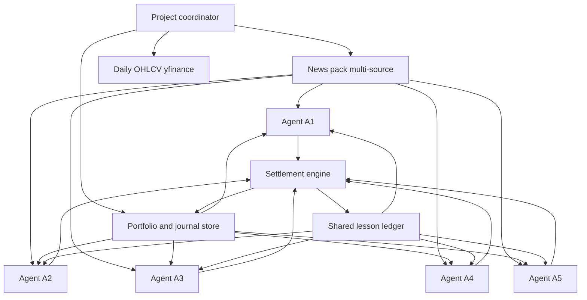

# DayTrade simulator plan

Cursor-orchestrated investment simulator: five rules-constrained agents with different LLMs each place one pre-market trade batch per US trading day, driven by multi-source news, own history, and shared lessons.

## Locked decisions

- **Universe:** US equities and ETFs only; long-only; fractional shares (required at $100 start).
- **Capital:** $100 per agent; sim start **2026-06-01**; step one trading day at a time through “today,” then live pre-market / EOD cadence.
- **Runtime:** entirely within Cursor (this Project + cloud agents). No changes to the current Kubespray checkout.
- **Decision style:** hard **rules** per risk tier; LLMs choose trades *inside* those rules.
- **Prices:** Yahoo Finance daily bars (`yfinance`) for OHLCV; fills at that day’s **open**.
- **News (bias-aware, 3+ sources):**
  1. **Reuters Business** — wire / institutional tone
  2. **Yahoo Finance** — retail + market summary tone
  3. **MarketWatch** — financial-media commentary tone
  4. **SEC EDGAR** (8-K / material event headlines) — filings, less editorial bias  
  Live: RSS + EDGAR atom. Backfill: **GDELT** DOC/GEO APIs filtered to those domains/topics for the same calendar day *before* US open (no lookahead).

## Five agents

| Agent | Risk | Cash floor | Max single name | Max positions | LLM (spread) |
|-------|------|------------|-----------------|---------------|--------------|
| A1 | Very conservative | 40% | 15% | 3 | `gpt-5.6-sol-medium` |
| A2 | Conservative | 25% | 25% | 4 | `claude-sonnet-5-thinking-medium` |
| A3 | Balanced | 15% | 35% | 6 | `gemini-3.8-flash-medium` |
| A4 | Aggressive | 5% | 50% | 8 | `claude-opus-5-thinking-medium` |
| A5 | Speculative | 0% | 80% | 10 | `grok-4.7-medium` |

Shared rules for all: US listed equity/ETF tickers only; no options/crypto/OTC; no shorts; one batch per day; batch must validate or is rejected and agent holds.

## Architecture



### Store layout (Project Context)

- `docs/project-context.md` — durable goals, rules, agent roster
- `docs/daytrade-simulator-plan.md` — this plan
- `state/sim-meta.json` — current sim date, mode (`backfill` \| `live`)
- `state/agents/A1…A5/portfolio.json` — cash, positions, cost basis
- `state/agents/A1…A5/journal/` — daily thesis, batch, EOD review
- `state/lessons/ledger.jsonl` — anonymized cross-agent lessons
- `state/news/YYYY-MM-DD.json` — frozen news pack for that day
- `state/market/YYYY-MM-DD.json` — opens/closes used for fills and marks
- `scripts/` — Python: news fetch, validate batch, settle day, advance calendar

### Daily cycle

1. **Pre-market pack:** build dated news pack (all sources, timestamps &lt; that day’s RTH open) + prior portfolios + lesson excerpts.
2. **Fan-out:** five cloud agents in parallel (models above); each returns one JSON trade batch + short thesis.
3. **Validate:** script enforces tier rules; invalid legs dropped or whole batch rejected per policy (reject whole batch).
4. **Settle open:** apply fills at open; update portfolios.
5. **EOD:** mark at close; write P&amp;L; each agent appends lessons; strip identity into shared ledger for others next day.
6. **Advance:** next trading day (skip weekends/NYSE holidays). Backfill loops until caught up; then live morning/EOD runs.

### Trade batch schema

```json
{
  "agent_id": "A3",
  "as_of": "2026-06-02",
  "orders": [
    {"side": "buy", "symbol": "VTI", "notional_usd": 20.0},
    {"side": "sell", "symbol": "AAPL", "qty": 0.15}
  ],
  "thesis": "…"
}
```

## Build sequence

1. **Foundation:** project context, agent roster/rules, empty portfolios ($100), sim meta at 2026-06-01, batch schema + validator.
2. **Market + news scripts:** trading calendar, yfinance open/close pull, multi-source news pack + GDELT backfill path, freeze under `state/`.
3. **Settlement engine:** apply validated batches, fractional positions, EOD marks, journal + lesson ledger writers.
4. **Agent prompts:** per-tier system rules + shared input pack format; coordinator fan-out using the five model IDs.
5. **Backfill driver:** loop trading days Jun 1 → today; pause for review checkpoints every ~20 sessions.
6. **Live mode:** after catch-up, morning expectation run + EOD results; track in `notes.md`.

## Out of scope (v1)

- Web UI, broker execution, options/crypto/shorts, intraday trading, optimizing for returns as a product goal (this is a planning/comparison simulator).
